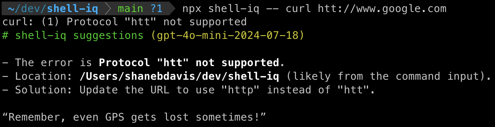

# shell-iq

**shell-iq** is an AI-powered tool that watches the `stdio` and `stderr` from a shell process and provides concise summaries of errors and successes. It’s particularly useful for accelerating development by analyzing dev-server or test outputs, allowing you to quickly identify and understand failures without manually digging through long logs.

## Features

- Monitors `stdout` and `stderr` from your shell processes
- Provides clear, succinct reports of errors and successes and provides suggestions for fixing them
- Combine it with a "watcher" that re-runs the command when it detects changes and get updated ai-generated summaries every time
- Works with any shell command (not limited to JAvaScript)

## Example



## Installation

You can run it with `npx`:

```bash
npx shell-iq -- your-command
```

You can also install shell-iq globally:

```bash
npm install -g shell-iq
```

## Usage

Before running `shell-iq`, ensure that you have your OpenAI API key available as an environment variable:

```bash
export OPENAI_API_KEY=your-api-key
```

To run your command and have `shell-iq` monitor it, use the following command:

```bash
./shell-iq -- your-command
```

Replace `your-command` with the actual command you want to run and monitor.

### Example:

```bash
export OPENAI_API_KEY=xyz
./shell-iq -- npm run test
```

In this example, `shell-iq` will monitor the output of your test command and provide a concise summary of errors and successes.

## Privacy

`shell-iq` does not store any of your data. It only sends the output of your command to OpenAI for analysis.

## License

MIT License
